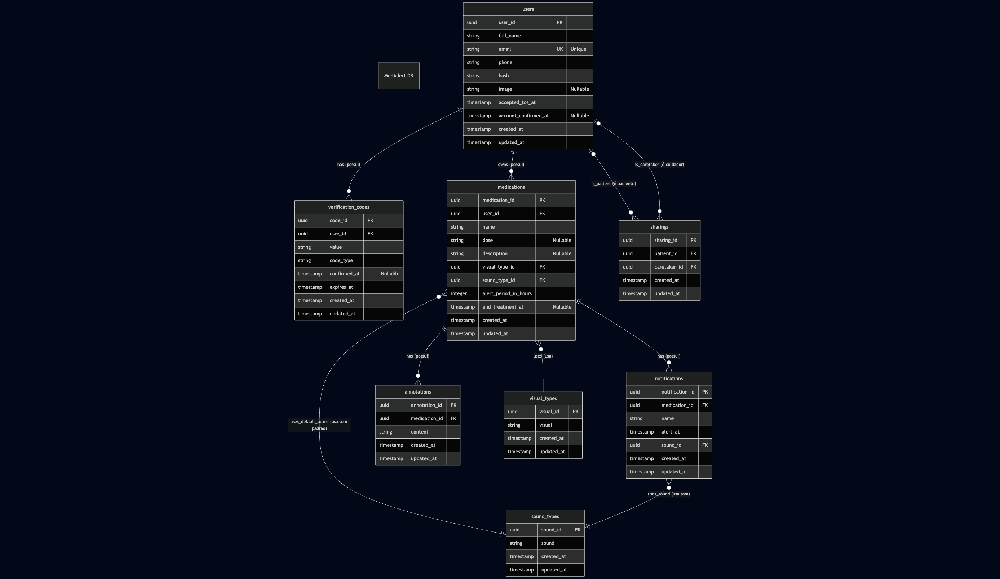
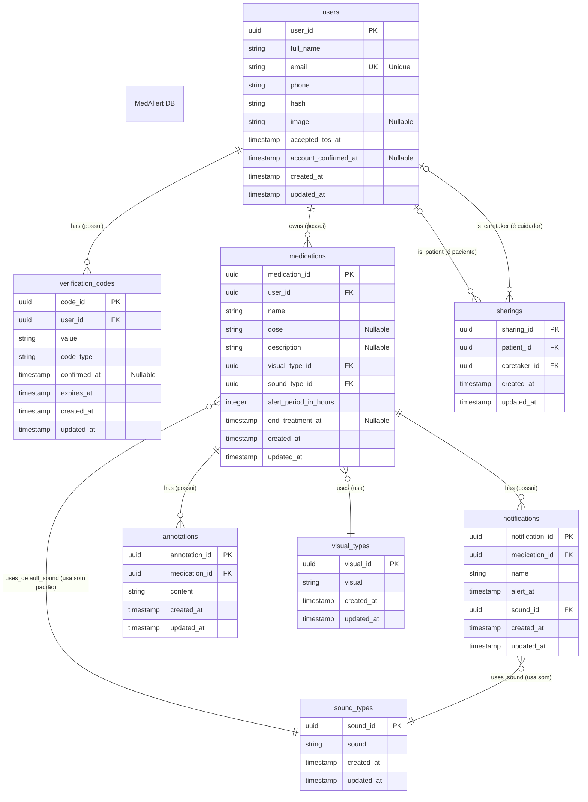

# MedAllert App — Esquema do Banco de Dados

Este documento descreve o esquema do banco de dados para a aplicação MedAllert. O objetivo principal é gerenciar usuários, seus medicamentos, agendamentos de notificação e dados relacionados para garantir lembretes de medicação oportunos.

---

## Tabela: users

Armazena informações sobre os usuários da aplicação.

| Nome da Coluna         | Tipo de Dado | Descrição                                                   | Notas           |
| :--------------------- | :----------- | :---------------------------------------------------------- | :-------------- |
| `user_id`              | `uuid`       | Identificador único para o usuário                          | **Primary Key** |
| `full_name`            | `string`     | O nome completo do usuário                                  |                 |
| `email`                | `string`     | O endereço de e-mail do usuário, usado para login e contato | **Unique**      |
| `phone`                | `string`     | O número de telefone do usuário                             |                 |
| `hash`                 | `string`     | Hash da senha para autenticação do usuário                  |                 |
| `image`                | `string`     | URL da foto de perfil do usuário                            | Nullable        |
| `accepted_tos_at`      | `timestamp`  | Data e hora em que o usuário aceitou os termos de serviço   |                 |
| `account_confirmed_at` | `timestamp`  | Data e hora em que o usuário confirmou sua conta            | Nullable        |
| `created_at`           | `timestamp`  | Data e hora de quando a conta do usuário foi criada         |                 |
| `updated_at`           | `timestamp`  | Data e hora da última atualização da conta do usuário       |                 |

---

## Tabela: verification_codes

Armazena códigos de uso único para diversas ações, como recuperação de conta e confirmação de e-mail.

| Nome da Coluna  | Tipo de Dado | Descrição                                             | Notas                         |
| :-------------- | :----------- | :---------------------------------------------------- | :---------------------------- |
| `code_id`       | `uuid`       | Identificador único para o código de verificação      | **Primary Key**               |
| `user_id`       | `uuid`       | O usuário ao qual este código pertence                | Foreign Key → `users.user_id` |
| `value`         | `string`     | O valor do código de uso único                        |                               |
| **`code_type`** | **`string`** | **O tipo do código (ex: "CONFIRMATION", "RECOVERY")** |                               |
| `confirmed_at`  | `timestamp`  | Data e hora em que o código foi usado                 | Nullable                      |
| `expires_at`    | `timestamp`  | Data e hora em que o código irá expirar               |                               |
| `created_at`    | `timestamp`  | Data e hora em que o código foi gerado                |                               |
| `updated_at`    | `timestamp`  | Data e hora da última atualização do código           |                               |

---

## Tabela: medications

Armazena detalhes sobre um medicamento específico que um usuário precisa tomar.

| Nome da Coluna          | Tipo de Dado | Descrição                                                        | Notas                                  |
| :---------------------- | :----------- | :--------------------------------------------------------------- | :------------------------------------- |
| `medication_id`         | `uuid`       | Identificador único para a entrada de medicação                  | **Primary Key**                        |
| `user_id`               | `uuid`       | O usuário ao qual este medicamento pertence                      | Foreign Key → `users.user_id`          |
| `name`                  | `string`     | O nome do medicamento (ex: "Ibuprofeno")                         |                                        |
| `dose`                  | `string`     | A dosagem do medicamento (ex: "500mg", "1 comprimido")           | Nullable                               |
| `description`           | `string`     | Detalhes adicionais sobre o medicamento (ex: "Tomar com comida") | Nullable                               |
| `visual_type_id`        | `uuid`       | A representação visual do medicamento (ex: pílula, líquido)      | Foreign Key → `visual_types.visual_id` |
| `sound_type_id`         | `uuid`       | O som de notificação padrão para este medicamento                | Foreign Key → `sound_types.sound_id`   |
| `alert_period_in_hours` | `integer`    | O intervalo em horas entre as doses/lembretes                    |                                        |
| `end_treatment_at`      | `timestamp`  | A data e hora em que o tratamento termina                        | Nullable                               |
| `created_at`            | `timestamp`  | Data e hora em que o medicamento foi adicionado                  |                                        |
| `updated_at`            | `timestamp`  | Data e hora da última atualização do medicamento                 |                                        |

---

## Tabela: notifications

Representa um alerta ou lembrete específico para um medicamento.

| Nome da Coluna    | Tipo de Dado | Descrição                                           | Notas                                     |
| :---------------- | :----------- | :-------------------------------------------------- | :---------------------------------------- |
| `notification_id` | `uuid`       | Identificador único para a notificação              | **Primary Key**                           |
| `medication_id`   | `uuid`       | O medicamento ao qual esta notificação se refere    | Foreign Key → `medications.medication_id` |
| `name`            | `string`     | Um nome para a notificação (ex: "Dose da Manhã")    |                                           |
| `alert_at`        | `timestamp`  | A hora exata em que a notificação deve ser acionada |                                           |
| `sound_id`        | `uuid`       | O som a ser tocado para esta notificação            | Foreign Key → `sound_types.sound_id`      |
| `created_at`      | `timestamp`  | Data e hora em que a notificação foi criada         |                                           |
| `updated_at`      | `timestamp`  | Data e hora da última atualização da notificação    |                                           |

---

## Tabela: annotations

Armazena notas ou registros adicionados pelo usuário relacionados a um medicamento.

| Nome da Coluna  | Tipo de Dado | Descrição                                            | Notas                                     |
| :-------------- | :----------- | :--------------------------------------------------- | :---------------------------------------- |
| `annotation_id` | `uuid`       | Identificador único para a anotação                  | **Primary Key**                           |
| `medication_id` | `uuid`       | O medicamento ao qual esta anotação está relacionada | Foreign Key → `medications.medication_id` |
| `content`       | `string`     | O conteúdo de texto da anotação                      |                                           |
| `created_at`    | `timestamp`  | Data e hora em que a anotação foi criada             |                                           |
| `updated_at`    | `timestamp`  | Data e hora da última atualização da anotação        |                                           |

---

## Tabela: sharings

Gerencia as relações cuidador-paciente, permitindo que um usuário visualize (apenas leitura) o cronograma de outro.

| Nome da Coluna | Tipo de Dado | Descrição                                                     | Notas                         |
| :------------- | :----------- | :------------------------------------------------------------ | :---------------------------- |
| `sharing_id`   | `uuid`       | Identificador único para a relação de compartilhamento        | **Primary Key**               |
| `patient_id`   | `uuid`       | O usuário que está compartilhando suas informações (paciente) | Foreign Key → `users.user_id` |
| `caretaker_id` | `uuid`       | O usuário que está visualizando as informações (cuidador)     | Foreign Key → `users.user_id` |
| `created_at`   | `timestamp`  | Data e hora em que a relação de compartilhamento foi criada   |                               |
| `updated_at`   | `timestamp`  | Data e hora da última atualização da relação                  |                               |

Constraint: Composite Unique on (`patient_id`, `caretaker_id`)

---

## Tabela: visual_types

Armazena tipos visuais predefinidos para medicamentos (ex: pílula, cápsula, xarope).

| Nome da Coluna | Tipo de Dado | Descrição                                     | Notas           |
| :------------- | :----------- | :-------------------------------------------- | :-------------- |
| `visual_id`    | `uuid`       | Identificador único para o tipo visual        | **Primary Key** |
| `visual`       | `string`     | O nome do tipo visual (ex: "Pílula")          |                 |
| `created_at`   | `timestamp`  | Data e hora em que o registro foi criado      |                 |
| `updated_at`   | `timestamp`  | Data e hora da última atualização do registro |                 |

---

## Tabela: sound_types

Armazena sons de notificação predefinidos que os usuários podem escolher.

| Nome da Coluna | Tipo de Dado | Descrição                                     | Notas           |
| :------------- | :----------- | :-------------------------------------------- | :-------------- |
| `sound_id`     | `uuid`       | Identificador único para o som                | **Primary Key** |
| `sound`        | `string`     | O nome do arquivo de som ou identificador     |                 |
| `created_at`   | `timestamp`  | Data e hora em que o registro foi criado      |                 |
| `updated_at`   | `timestamp`  | Data e hora da última atualização do registro |                 |

---

## Diagrama Entidade-Relacionamento (ER)

[Diagrama criado com Mermaid](https://mermaid.live/edit#pako:eNq1Vktu2zAQvYrAVQo4QWzHkqxd26CbIEU32RQGBFYaW0QkUuUnTWr7NF31HLlYh7QsS5GUf72xpJk3n8c3JNckESmQiIA8Z3QlaeEtyCWkH_McpPbOPy3Ignv4Mwqk8ta7F_fBsNR9jfH_28XBoLRkfOUtTZ7HnBbQsUBBWe5dXWCmK85-GtjnaPiUmeBdZEZV1vnICroCjPUVE9IfeSuaZgUoTYvSo0kCpYY01kLFVA-4CMN1nAi-ZLJAX6qfjJtIoNq59llNmbas2wXfPdyAZEuWUM0Ej-0SdLm1Xx9y2yL9S5f0G5qbLm0ukr4robeBl3QLtyWTMETgK7nA3BUTXRIOtpdS0Su9VKghqew9QCWSlTbjgKNLfMOUobkj9WF-Z1eopLTXzLiGFUiP2gGLS9SBSGPG40wYqXo5t4EsswWgOP-fJLnQtSS7C9G09i5Fe6WeXJDG2DkimsU2GHwQ6s1NUo6NDLR4sL2uQZwkjUv0jtWqjNrI3VIrQ2-dJdZoldIny4RK0PS6OzRv39AOA9EttzL2HxQ743uyVs9eD3F7VfUU4mzvWMfuyNxsjo_Fum_Dj3CS8UTzjkqhlGEf2kdthWtujhYgfvFBhHCIWjTWnam40oN3dP8XtZHYZ3geslaLwybIH02FrLHN0qpq23vIUIM9wOZcPge2xYo3m7bqLA77QaBR9DFUUyB7UJzCkppcx87oQqBfgYyl8v6PqMO1O3wsYDsQBiAjspIsJZGWBkakAIkXIXwlTqQLojPAHZLYACmV1zbjFjEl5d-FKPYwKcwqI9GS5grfduKrrm61Cx4ZID_bywyJxr4LQaI1uSWRPzmZhWdhcDo_m0-CiT8ekTsSHYfhSTAbj0-DcH4WnIYTfzsiv13S8cl0OpkH_sz3p7NpOA1GBAnVQl7u7o3u-rj9B5dDUfI)

---

## Glossário

- **Primary Key**: Identificador único para cada registro em uma tabela.
- **Foreign Key**: Campo que cria um vínculo com a chave primária de outra tabela.
- **Nullable**: Indica que um campo pode não ter um valor (pode ser nulo).
- **Unique**: Restrição que garante que todos os valores em uma coluna sejam distintos.
- **Composite Unique Constraint**: Restrição de unicidade aplicada a uma combinação de colunas.
- **UUID**: Identificador universalmente único usado para evitar conflitos de ID.
- **Timestamp**: Tipo de dado que armazena um ponto específico no tempo (data e hora).
- **Hash**: Resultado de uma função criptográfica que transforma dados em uma string de tamanho fixo.
